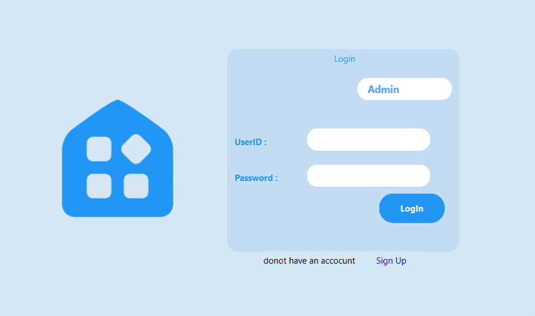

# Inventory Management System
This Inventory Management System project is developed in C++ using the Qt framework. It provides a user-friendly interface to manage inventory, track sales and profits, manage customers and employees, and interact with vendors.

## Features
### Admin Menu
- View profit and loss reports
- Monitor sales and revenue
- Manage customers and employees
- Manage inventory items
- Send purchase requests to vendors
### Vendor Menu
- View and respond to purchase requests
- Manage inventory availability
### Customer Menu
- Place orders
- Add items to the cart
- View total cash amount
- Calculate change after purchase
## Requirements
- C++ compiler compatible with your operating system
- Qt framework (version 6.5.0)
## Installation
1. Clone the repository clone https://github.com/umerghafoor/InventorySysytem
2. Install the necessary dependencies, including the Qt framework. https://www.qt.io/download
3. Build the project using your preferred build system or IDE, ensuring that all dependencies are properly configured.
4. Run the executable file generated after the build process.
## Contributing
Contributions to this project are welcome! If you find any issues or have suggestions for improvements, please open an issue or submit a pull request. Make sure to follow the project's coding conventions and guidelines.
## License
This Project is open sourse.
## Contact
For any inquiries or feedback, please contact **Umer Ghafoor** at *umerghaforr@gmail.com*.
